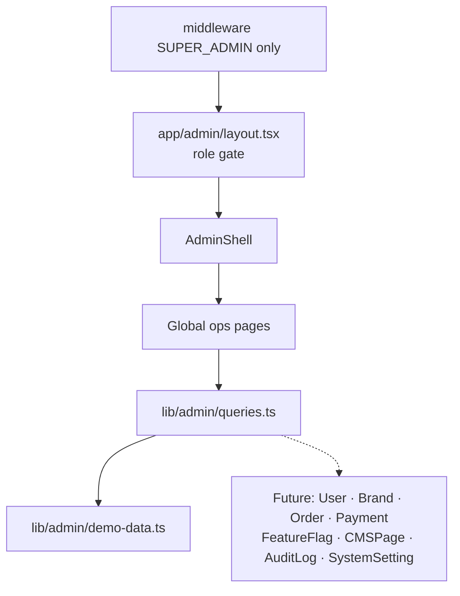

# Stage 8 — Super Admin Portal Review

Review date: 2026-07-24  
Scope: `/admin/**` unrestricted Super Admin console  
Verdict: **Pass for Stage 8** — full enterprise IA, RBAC-hardened shell, charts/widgets, and operational surfaces. Demo-backed until platform APIs land.

## Architecture

Same operational pattern as Stages 6–7:
- Edge RBAC + layout defense-in-depth
- Collapsible sidebar + mobile drawer + ThemeToggle
- Query façade over fixtures (swap to Prisma later)
- Optimistic demo mutations via toasts

## Surface coverage

| Requested | Route | Status |
| --- | --- | --- |
| Global Dashboard | `/admin` | KPIs, health rings, revenue chart, fraud/brand queues |
| Brand Management | `/admin/brands` | Approve/suspend demo |
| Customer Management | `/admin/customers` | Risk scoring highlight |
| Order Management | `/admin/orders`, detail | Refund / force-ship demo |
| Payments | `/admin/payments` | Provider + status ledger |
| Shipping | `/admin/shipping` | Carrier tracking board |
| CMS | `/admin/cms` | Page lifecycle |
| Reports | `/admin/reports` | Generate/download demo |
| Feature Flags | `/admin/feature-flags` | Rollout % + env tags |
| Localization | `/admin/localization` | Locale coverage |
| Email Templates | `/admin/email-templates` | Preview/edit demo |
| Audit Logs | `/admin/audit-logs` | Immutable-style trail + IP |
| System Settings | `/admin/settings` | Maintenance, checkout, theme |
| Analytics | `/admin/analytics` | Line + donut charts |
| Fraud Monitoring | `/admin/fraud` | Severity queue |
| Security Center | `/admin/security` | MFA/sessions/policies |
| User Management | `/admin/users` | Invite/disable demo |
| Permissions | `/admin/permissions` | Role · resource · action |
| Logs | `/admin/logs` | System log levels |
| Enterprise Charts | dashboard + analytics | LineChart, DonutChart |
| Admin Widgets | dashboard | KpiCard, StatWidget, ProgressRing, ActivityFeed |

## Security model

- `/admin` and `/api/admin` are **SUPER_ADMIN only** (`lib/auth/rbac.ts`).
- Layout rejects any other authenticated role → `/forbidden`.
- Super Admin is unrestricted across brands (by design); Brand Manager remains brand-scoped under `/brand`.
- Audit UI maps to Prisma `AuditLog`; write path not wired yet.
- Fraud has no dedicated Prisma model — UI uses operational cases; harden via `PaymentEvent` + rules engine later.

## Boundaries (accepted)

1. Fixtures only — no live `/api/admin` handlers yet (pattern reserved).
2. Mutations are toast demos.
3. Categories / Taxes / Support modules from broader UX IA remain optional expansions (not in Stage 8 request list).
4. Hard production secrets/feature flag evaluation engines deferred.

## Stop criteria

Stage 8 complete. Do not start a further stage unless explicitly requested.
