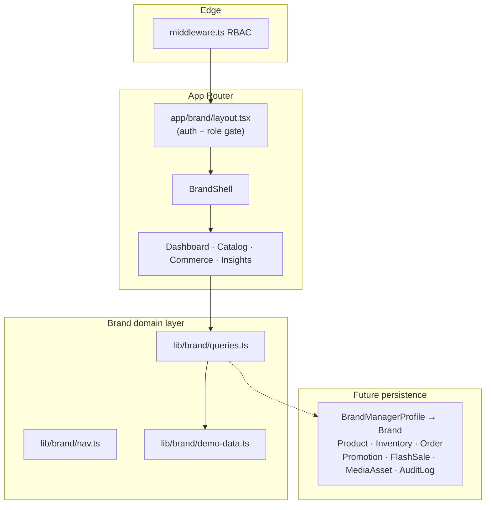

# Stage 7 — Brand Manager Portal Architecture Review

Review date: 2026-07-24  
Scope: `/brand/**` Brand Manager workspace  
Verdict: **Pass for Stage 7** — enterprise-shaped portal with clear layering, RBAC gates, and brand-scoped demo domain. Live Prisma persistence and hard multi-tenant enforcement remain Stage 8+ service work.

## Architecture overview

## Layers

| Layer | Responsibility | Location |
| --- | --- | --- |
| **Edge RBAC** | Allow `BRAND_MANAGER` + `SUPER_ADMIN` on `/brand` and `/api/brand` | `lib/auth/rbac.ts`, `middleware.ts` |
| **Layout gate** | Session required; non-BM roles → `/forbidden` | `app/brand/layout.tsx` |
| **Presentation shell** | Sidebar IA, mobile drawer, theme, skip link | `components/brand/brand-shell.tsx` |
| **Pages** | Route-level UX composition | `app/brand/**` |
| **Query facade** | Async getters (swap demo → Prisma later) | `lib/brand/queries.ts` |
| **Fixtures** | Brand-scoped production-shaped data | `lib/brand/demo-data.ts` |

This mirrors Stage 6 account architecture deliberately so customer / brand / (future) admin portals share one operational pattern.

## Surface map

| Capability | Route | Notes |
| --- | --- | --- |
| Dashboard | `/brand` | Sales today, orders, shipments, inventory alerts, revenue chart, activity |
| Products | `/brand/products`, `/brand/products/[id]` | Catalog + detail + storefront link |
| Inventory | `/brand/inventory` | Variant stock, low/out emphasis, adjust demo |
| Orders | `/brand/orders`, `/brand/orders/[orderNumber]` | Fulfillment actions (demo) |
| Coupons | `/brand/coupons` | Active/scheduled + create demo |
| Flash sales | `/brand/flash-sales` | Live/scheduled campaigns |
| Analytics | `/brand/analytics` | KPIs + LineChart + DonutChart |
| Customers | `/brand/customers` | Brand purchasers only (fixture) |
| Media library | `/brand/media` | Asset grid + upload demo |
| Reports | `/brand/reports` | CSV/XLSX/PDF generate/download demo |
| Activity logs | `/brand/activity` | Audit-style feed (maps to `AuditLog`) |
| Settings / Profile | `/brand/settings`, `/brand/profile` | Notifications, SLA, dark mode |

## Security & tenancy

- **Route protection**: middleware + layout double gate (defense in depth).
- **Scope rule (SRS)**: Brand Manager sees **own brand only**. Stage 7 encodes this in fixtures (`brandWorkspace.brandId`) and copy; **service-layer filters on `BrandManagerProfile.brandId` are still required** before production DB wiring.
- **Audit**: UI surfaces activity logs; immutable writes belong on `AuditLog` when mutations go live.
- **SUPER_ADMIN**: may enter `/brand` for support; must not inherit BM data unless impersonation is explicit (future).

## Design system reuse

Enterprise UX is composed from existing DS primitives (no parallel component system):
- Charts: `LineChart`, `DonutChart`
- Dashboard: `KpiCard`, `ActivityFeed`
- Layout/nav: `PageHeader`, `Sidebar`, `ThemeToggle`
- Commerce: `OrderStatusBadge`, `Price`

## Boundaries (accepted for Stage 7)

1. Query layer returns demo fixtures — Prisma models already exist for the swap.
2. Mutations are optimistic UI (toasts) — no `/api/brand` handlers yet (RBAC pattern reserved).
3. No Bulk CSV import UI yet (SRS item deferred; reports cover export-shaped flows).
4. Hard brand isolation in repositories not implemented — documented as next hardening step.

## Stop criteria

Stage 7 complete. Do not start Stage 8 (Super Admin) unless explicitly requested.
