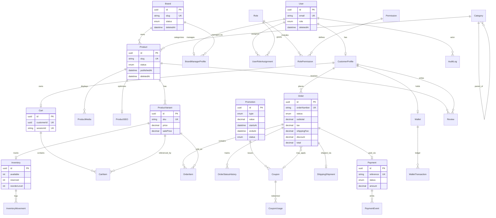

# Entity Relationship Diagram — Core Commerce

Stage 3 core entities. See `prisma/schema.prisma` for the full ~80–95 model production schema.



## Order status flow (SRS 11+ states)

```
PENDING → CONFIRMED → PAID → PROCESSING → PACKED → SHIPPED
    → OUT_FOR_DELIVERY → DELIVERED → COMPLETED

CANCELLED ← (from early states)
REFUND_REQUESTED → REFUNDED
```

Status transitions are recorded in `OrderStatusHistory` (immutable append).

## Inventory flow

```
available ──reserve──▶ reserved ──commit──▶ (sold, movement logged)
    ▲                      │
    └──── release ─────────┘
```

All quantity changes create an `InventoryMovement` row inside the same transaction.
