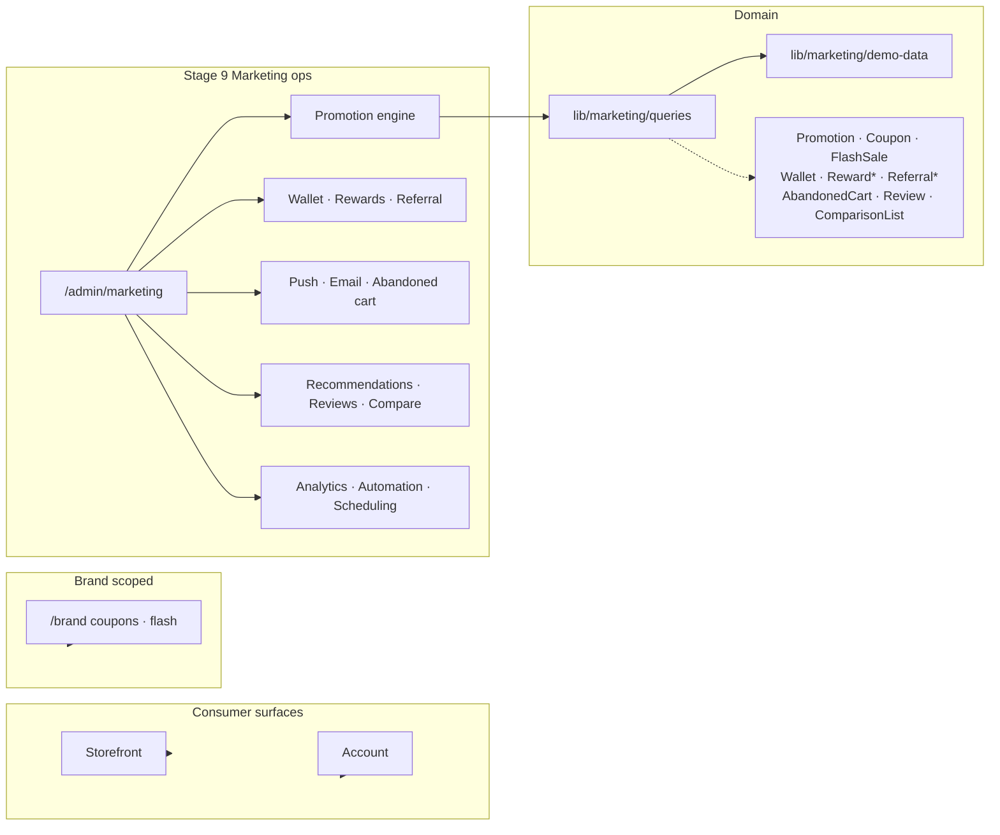

# Stage 9 — Marketing Platform Architecture Review

Review date: 2026-07-24  
Scope: `/admin/marketing/**` Super Admin marketing ops console  
Verdict: **Pass for Stage 9** — full marketing IA covering promotion engine through automation/scheduling, layered atop existing consumer/brand surfaces from Stages 5–7.

## Placement decision

Marketing ops lives under **Super Admin** (`/admin/marketing/**`), not a fourth portal root.

| Concern | Decision |
| --- | --- |
| Authority | Platform-wide campaigns require `SUPER_ADMIN` (UX IA: Super Admin owns Marketing + Flash Sales) |
| Brand scope | Brand Managers keep `/brand/coupons` + `/brand/flash-sales` for own-brand campaigns |
| Consumers | Storefront/account continue to *consume* coupons, flash, rewards, wallet, referral, compare, recently viewed |
| RBAC | Inherits `/admin` SUPER_ADMIN-only gate — no new role |

## Layering

## Module coverage

| Requested capability | Route | Notes |
| --- | --- | --- |
| Promotion Engine | `/admin/marketing/promotions` | %, fixed, free shipping, BXGY; priority; stackability; targeting |
| Coupons | `/admin/marketing/coupons` | Codes, limits, min order |
| Flash Sales | `/admin/marketing/flash-sales` | Canonical August Grand Opening campaign |
| Wallet | `/admin/marketing/wallet` | Platform wallet ledger overview |
| Reward Points | `/admin/marketing/rewards` | Earn/redeem/expire rules |
| Referral | `/admin/marketing/referral` | Codes + conversion stats |
| Affiliate | `/admin/marketing/affiliate` | **Partner program UI** — no Prisma `Affiliate*` yet (explicit extension) |
| Push Notifications | `/admin/marketing/push` | Campaign scheduling/send metrics |
| Email Campaigns | `/admin/marketing/email-campaigns` | Complements `/admin/email-templates` |
| Abandoned Cart | `/admin/marketing/abandoned-cart` | Recovery queue + reminders |
| Recommendations | `/admin/marketing/recommendations` | Placement/algorithm configs |
| Recently Viewed | `/admin/marketing/recently-viewed` | Merchandising insight |
| Review System | `/admin/marketing/reviews` | Moderation queue |
| Product Comparison | `/admin/marketing/comparison` | Usage analytics (storefront `/compare` remains UX) |
| Analytics | `/admin/marketing/analytics` | Promo vs organic + channel mix charts |
| Dashboards | `/admin/marketing` | Hub KPIs + queues |
| Automation | `/admin/marketing/automation` | Trigger → action workflows |
| Campaign Scheduling | `/admin/marketing/scheduling` | Cross-channel calendar |

## Relationship to earlier stages

- **Stage 5**: Storefront flash sale, coupon input, compare, recently viewed — demand side.
- **Stage 6**: Account wallet/rewards/referral/coupons — member benefits.
- **Stage 7**: Brand coupons/flash — brand-scoped ops.
- **Stage 8**: Admin email templates, CMS — adjacent content tools.
- **Stage 9**: Platform marketing control plane that configures and monitors the above.

## Boundaries (accepted)

1. Query layer is demo-backed; Prisma models already exist for nearly all modules except **Affiliate**.
2. Mutations are optimistic demo toasts — wire to `/api/admin/marketing` later.
3. Affiliate is intentionally UI-first; add `AffiliatePartner` / `AffiliateCommission` models in a follow-on schema migration if product confirms the program.
4. Live checkout still uses existing promotion repository + demo coupon codes until marketing ops APIs publish campaigns.

## Stop criteria

Stage 9 complete. Do not start a further stage unless explicitly requested.
